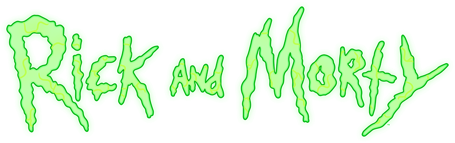
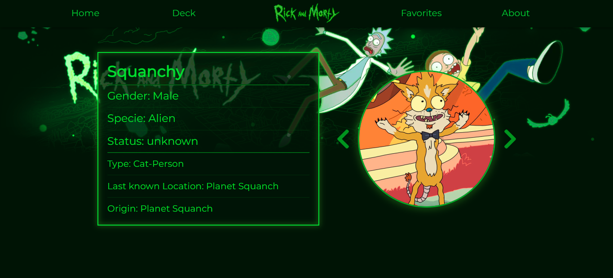

### Deploy Status

[](https://app.netlify.com/sites/nazarenocarlesso-rick-and-morty/deploys)

# About The Project

#### Find your favorite rick and morty characters.

You have access to about 800+ characters from over 100+ diferent locations and 51 episodes and collect them in a deck of cards.

I built this app during my four months Fullstack Developer Bootcamp at soyHenry to demonstrate what has been learned and explore our creativity.

### Made by

#### Nazareno Carlesso

Fullstack Web Developer, who likes to learn new things and collaborate in different types of projects, like this website.

### Build With


# Getting Started

### Instalation

To setup the frontend first we need to install the dependencies.

1. Access the package.json inside frontend subdirectory
2. Open it with the integrated terminal
3. Enter the next command line

```
npm install
```

4. It will open in a new window of our browser using the next command line

```
npm start
```

### Environment

There will be no cards, because our website is not connected with the API

5. Create a new file .env inside frontend subdirectory with the variables

```
REACT_APP_BACK=https://rickandmortyapi.com
```

### API

It will work with the previous API but the proyect has it's own API that contains the logic of the endpoint routes

6. Repeat the instalation process but now inside the backend subdirectory

7. Server will listen our request with the next command line

```
npm run dev
```

### Environment

To run the API in our local machine, we should first declare the port

8. Create a new file .env inside backend subdirectory with the variables

Example: *(you can choose any port)*
```
PORT=3000 
```

### Finish

To connect the frontend with the backend modify the environment variables.

You need to restart the server anytime environment variables are changed.

# Screenshots





### Thanks for visiting

Would be nice if you leave a star